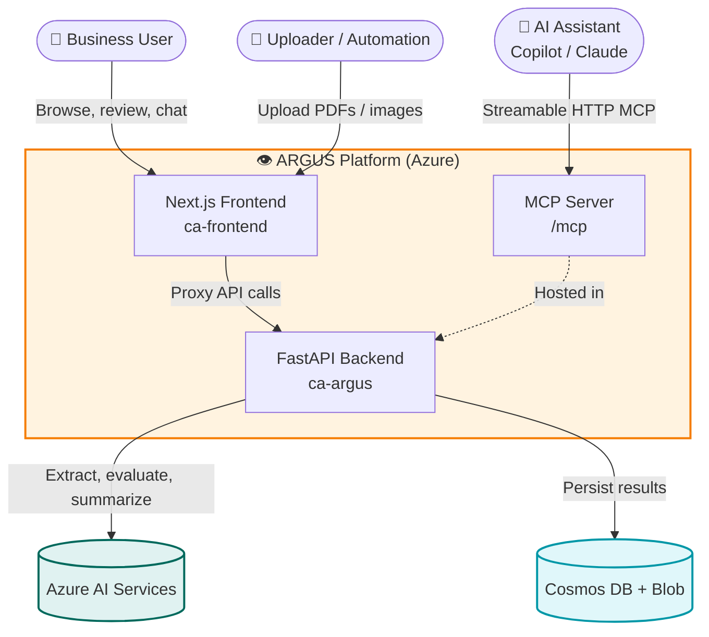
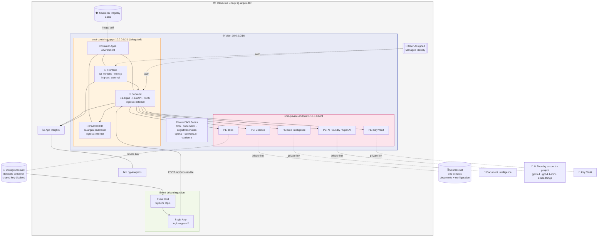
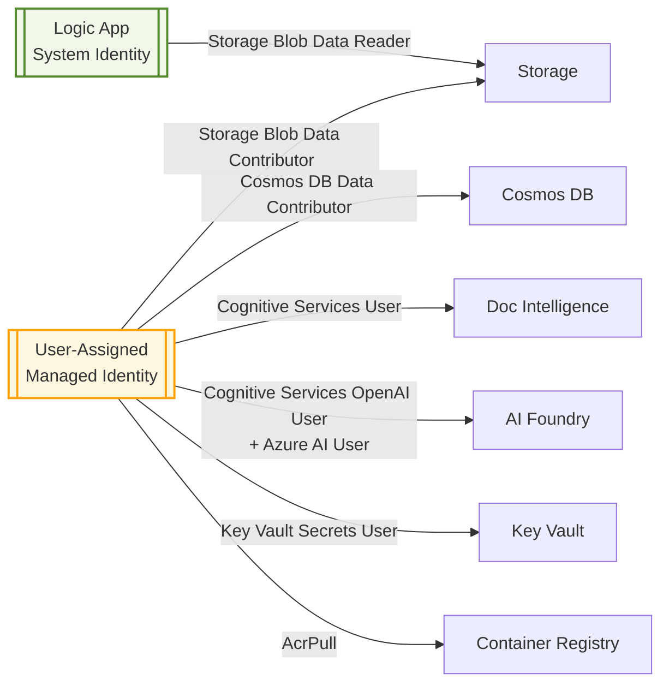
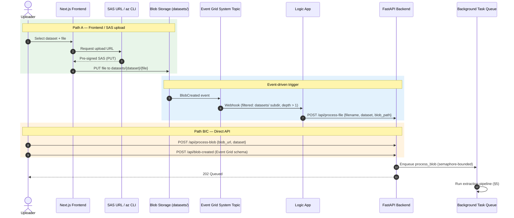
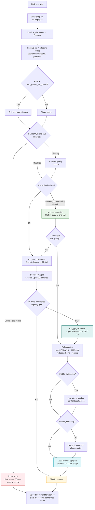
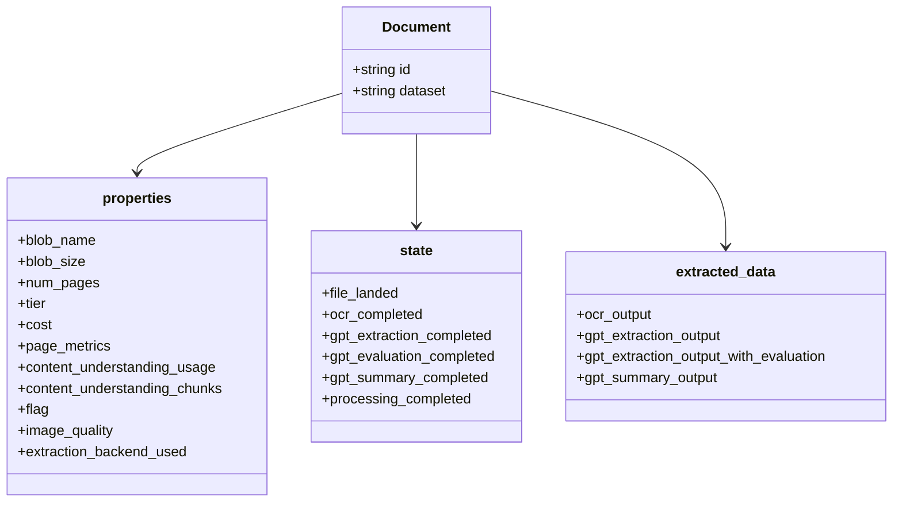
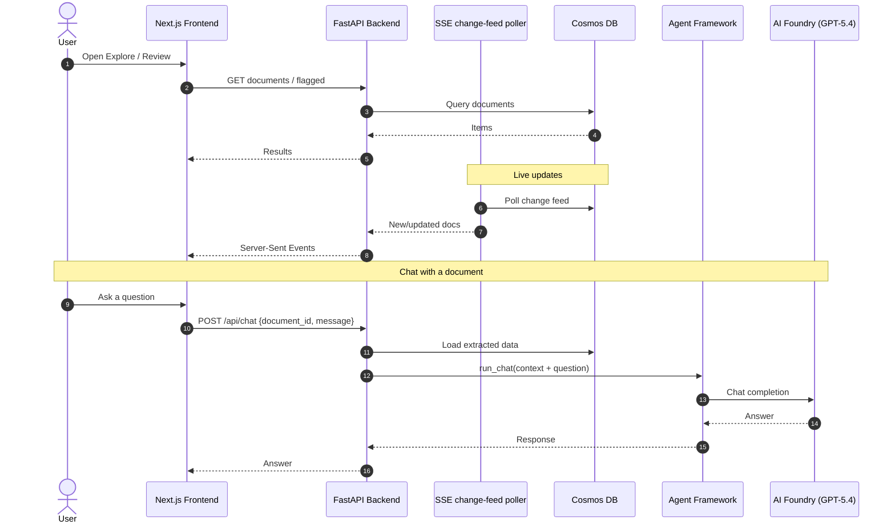
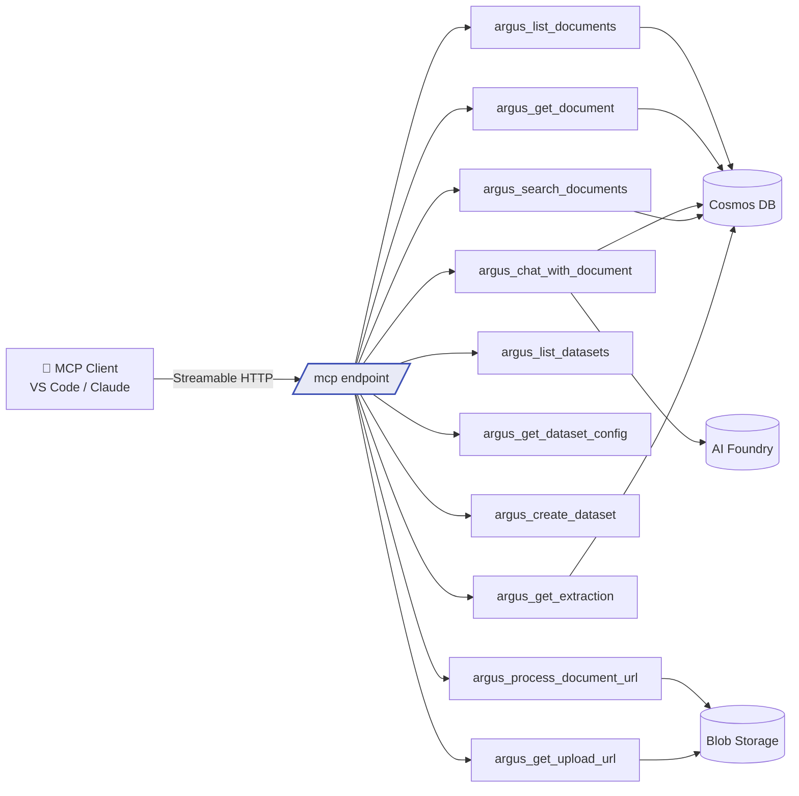
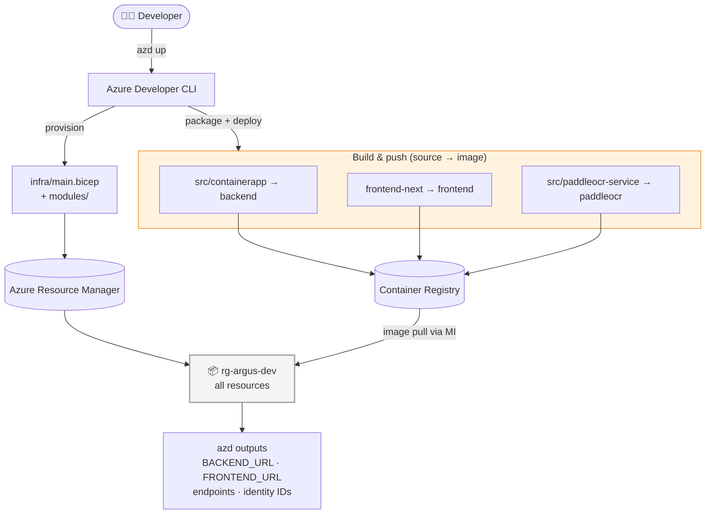

# 🏛️ ARGUS Architecture

This document describes the **solution flow** and **Azure architecture** of ARGUS
(Automated Retrieval and GPT Understanding System), a cloud-native document
intelligence platform. It complements the high-level overview in the
[README](../README.md) with detailed diagrams derived directly from the source
tree (`src/`, `frontend-next/`, `infra/`).

> All diagrams are rendered with [Mermaid](https://mermaid.js.org/). GitHub renders
> them natively; in VS Code use the built-in Markdown preview.

---

## 1. System Context

Who and what interacts with ARGUS, and through which surface.

---

## 2. Azure Architecture (Network & Services)

Every backing service is reachable **only** through private endpoints inside a
dedicated VNet. Container Apps run in a delegated subnet; all other services sit
behind private endpoints in a second subnet, resolved via Private DNS zones.

### Resource inventory

| Resource | Bicep module | Purpose |
|----------|--------------|---------|
| VNet + subnets + Private DNS | `network.bicep` | Network isolation & name resolution |
| User-assigned Managed Identity | `identity.bicep` | Zero-credential service-to-service auth |
| Log Analytics + App Insights | `monitoring.bicep` | Telemetry, logs, distributed tracing |
| Key Vault (PE) | `key-vault.bicep` | Secret storage |
| Storage Account (PE) | `storage.bicep` | `datasets` blob container |
| Cosmos DB (PE) | `cosmos.bicep` | `documents` + `configuration` containers |
| Document Intelligence (PE) | `document-intelligence.bicep` | OCR / layout extraction |
| AI Foundry account + project (PE) | `ai-services.bicep` | GPT-5.4, summary model, embeddings, Content Understanding |
| Container Registry | `container-registry.bicep` | Private container images |
| Container Apps (Env + 3 apps) | `container-apps.bicep` | Backend, frontend, PaddleOCR |
| RBAC role assignments | `role-assignments.bicep` | Least-privilege access |
| Event Grid + Logic App | `event-processing.bicep` | Blob-created → process trigger |

---

## 3. Identity & RBAC

All access is granted via Azure RBAC to a single user-assigned managed identity —
`disableLocalAuth: true` and `allowSharedKeyAccess: false` everywhere.

---

## 4. Document Ingestion & Event Flow

Documents can enter the pipeline three ways. The automated path uses Event Grid +
Logic App; manual and programmatic paths call the backend directly.

---

## 5. Document Processing Pipeline

The core of `blob_processing.process_blob` + `ai_ocr.process`. Content
Understanding is the default extraction backend; the GPT (vision) path is used by
explicit override or as a silent fallback when CU output reads low-quality.

### Pipeline stages persisted on the document

Each stage flips a boolean in `state.*` and appends cost telemetry to
`properties.cost`. The document schema tracked in Cosmos:

---

## 6. Consumption: Explore, Review, Chat & MCP

Results are consumed through the frontend (live-updated via SSE) and by AI
assistants through the MCP server.

For Content Understanding documents, `properties.page_metrics` records the CU
meter charge plus contextualization and LLM spend allocated equally across pages
within the same CU analyze chunk. `properties.content_understanding_chunks`
holds the compact chunk evidence (normalized output, field confidence, and CU
markdown) referenced by those page records. This preserves the exact chunk-level
billing input while clearly labeling extraction provenance as chunk-scoped when
CU does not provide reliable field-level page spans.

### MCP integration

The backend exposes a **Streamable HTTP** MCP endpoint (`/mcp`) so AI assistants
can drive ARGUS. Tools are plain Python callables auto-invoked by the Agent
Framework.

---

## 7. Deployment Topology (azd)

`azd up` provisions all infrastructure with Bicep and builds/pushes three
container images defined in `azure.yaml`.

| azd service | Source | Host | Ingress |
|-------------|--------|------|---------|
| `backend` | `src/containerapp` (Python) | Container App `ca-argus` | External :8000 |
| `frontend` | `frontend-next` (Next.js) | Container App `ca-frontend` | External |
| `paddleocr` | `src/paddleocr-service` (Docker) | Container App `ca-argus-paddleocr` | Internal |

---

## 8. Technology Summary

| Layer | Technology |
|-------|------------|
| API framework | FastAPI, Uvicorn, Pydantic (Python 3.13, uv) |
| AI orchestration | Microsoft Agent Framework → Azure AI Foundry |
| Models | GPT-5.4 (extraction/chat), gpt-4.1-mini (summary), text-embedding-3-large |
| OCR / extraction | Azure Document Intelligence, Content Understanding, Mistral (optional), PaddleOCR pre-gate |
| Data | Azure Cosmos DB, Azure Blob Storage |
| Frontend | Next.js 15, React, Tailwind CSS, shadcn/ui |
| Eventing | Event Grid system topic, Azure Logic Apps |
| Security | Managed Identity, RBAC, Private Endpoints, Key Vault, VNet |
| Observability | Application Insights, Log Analytics |
| IaC / deploy | Bicep (modular), Azure Developer CLI (azd) |

---

*Generated from the ARGUS codebase. Keep this document in sync with `infra/` and
`src/` when the architecture changes.*
